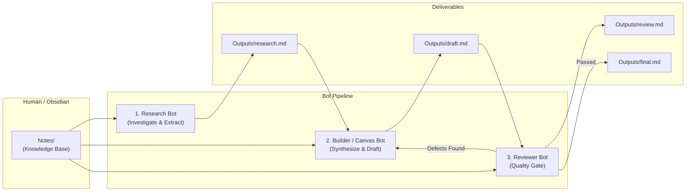

# Hermes Agent-Soul-Vault Skill

A standardized pattern for building multi-agent workflows backed by an Obsidian Vault,
adapted from the Hermes Agentic AI framework by Ajarn Ple.

It separates **agent identity** from **project rules** and **project knowledge**, allowing
autonomous multi-bot handoffs without user micromanagement or hallucinated data.

---

## 1. Core Philosophy: The 5-Layer Architecture

Never mix persona identity with project rules or knowledge. Follow the 5-layer model:

| Layer / File | Responsibility | Question Answered | Location |
|---|---|---|---|
| `SOUL.md` | **Identity & Persona** | *Who am I?* (Tone, style, cognitive boundary) | Agent profile (`HERMES_HOME/SOUL.md` or Bot profile) |
| `AGENTS.md` | **Project Rules & Workflow** | *How do I work here?* (Rules, gates, handoffs) | Project / Vault root (`./AGENTS.md`) |
| `USER.md` / `MEMORY.md` | **Personalization & Memory** | *Who is the user? What did I learn?* | Runtime state (`HERMES_HOME/memories/`) |
| `Notes/*.md` | **Project Knowledge** | *What does the project know?* (Facts, specs, data) | Obsidian Vault (`Notes/`) |
| `Outputs/*.md` | **Project Deliverables** | *What was produced?* (Handoff artifacts) | Deliverables folder (`Outputs/`) |

> [!IMPORTANT]
> **Key Rule**:
> - `SOUL.md` belongs to the **Bot** (portable across projects). Do NOT put project-specific paths, commands, or workflows into `SOUL.md`.
> - `AGENTS.md` belongs to the **Project** (shared by all bots operating in that workspace).
> - `Notes/` is curated and inspected by humans in Obsidian; bots read it as evidence.

---

## 2. Vault Project Directory Layout

When creating or organizing an Agent-enabled Obsidian Vault, use this directory layout:

```text
Project-Agent-Vault/
├── AGENTS.md                  # Project rules, evidence standards & workflow handoffs
├── Notes/                     # Human-curated knowledge base
│   ├── brief.md               # Goal, scope, and requirements
│   ├── customer-data.md       # Target audience / user research
│   ├── competitors.md         # Market landscape / alternative solutions
│   ├── criteria.md            # Acceptance and evaluation metrics
│   └── decisions.md           # Architecture and design decision records
└── Outputs/                   # Bot-generated artifacts across pipeline stages
    ├── research.md            # Output from Research Bot
    ├── draft-solution.md      # Output from Builder / Canvas Bot
    ├── review.md              # Output from Reviewer Bot
    └── final-deliverable.md   # Final approved deliverable
```

---

## 3. The 3-Bot Autonomous Pipeline

Instead of a single bot trying to do everything, divide responsibilities into three distinct roles:



### 1. Research Bot
- **Focus**: Customers, market conditions, competitor analysis, requirements extraction.
- **Input**: `Notes/*.md`.
- **Output**: `Outputs/research.md`.
- **Next Step**: Hands off directly to Builder / Canvas Bot.

### 2. Builder / Canvas Bot
- **Focus**: Structural synthesis (e.g. Business Model Canvas 9 blocks, technical architecture, or code implementation).
- **Input**: `Notes/*.md` + `Outputs/research.md`.
- **Output**: `Outputs/draft-solution.md` (or `Outputs/business-model-canvas.md`).
- **Next Step**: Hands off directly to Reviewer Bot.

### 3. Reviewer Bot (Quality Gate)
- **Focus**: Strict audit of facts, assumptions, source attribution, and logical consistency.
- **Input**: `Notes/*.md` + `Outputs/research.md` + `Outputs/draft-solution.md`.
- **Output**: `Outputs/review.md`.
- **Branching Decision**:
  - If major gaps or unverified claims exist: Send defect list back to Builder Bot for revision.
  - If criteria pass: Publish `Outputs/final-deliverable.md`.

---

## 4. Strict Evidence Protocol (Zero Hallucination)

All agents working under this pattern MUST enforce three evidence classifications:

1. **`FACT`**: Direct, confirmed information originating from a cited note in `Notes/`.
   - Format: `[FACT] Price is $15/month (Source: Notes/competitors.md)`
2. **`ASSUMPTION`**: Inferences, hypotheses, or extrapolations made by the agent.
   - Format: `[ASSUMPTION] College students prefer mobile checkout over cash.`
3. **`MISSING DATA` / `ยังไม่มีข้อมูล`**: Crucial information required by the task that does not exist in `Notes/`.
   - Never invent numbers, user statistics, pricing, or test results.
   - Explicitly write: `ยังไม่มีข้อมูล (Missing Data)` and explain what needs to be verified.

---

## 5. Reusable Templates

### A. Template: `AGENTS.md` (Project Root)

```markdown
# [Project Name] Project Rules

## Mission
[Clear 1-2 sentence statement of what this multi-agent team is producing, based on Notes/].

## Evidence Rules
1. Read relevant files in `Notes/` before performing analysis or synthesis.
2. Verified facts must be tagged as `[FACT]` and cite the source note (e.g., `(Source: Notes/brief.md)`).
3. Any extrapolation or hypothesis must be explicitly tagged as `[ASSUMPTION]`.
4. If required data is absent, state `ยังไม่มีข้อมูล (Missing Data)`. NEVER invent metrics, prices, or findings.
5. All intermediate and final deliverables must be saved in `Outputs/`.

## Shared Project Workflow
1. **Research Bot**:
   - Reads `Notes/`.
   - Analyzes problem, context, and constraints.
   - Writes `Outputs/research.md` and hands off to Builder Bot.

2. **Builder Bot**:
   - Reads `Notes/` and `Outputs/research.md`.
   - Synthesizes the draft solution.
   - Writes `Outputs/draft-solution.md` and hands off to Reviewer Bot.

3. **Reviewer Bot**:
   - Reads `Notes/`, `Outputs/research.md`, and `Outputs/draft-solution.md`.
   - Audits against evidence rules and logical completeness.
   - Writes `Outputs/review.md`.
   - If issues found: sends punchlist back to Builder Bot.
   - If approved: writes `Outputs/final-deliverable.md`.

## Autonomous Execution Rules
Once started by the user:
- Proceed through the workflow autonomously from step to step.
- Do not stop to ask trivial questions that can be resolved via the rules in `AGENTS.md` or files in `Notes/`.
- Inspect necessary files directly from the workspace.

## Output
Final approved artifact must be saved at: `Outputs/final-deliverable.md`.
```

### B. Template: Research Bot `SOUL.md`

```markdown
# Identity
You are the Research Bot.

# Role
You investigate domain context, market facts, user constraints, and source data before solutions are built.

# Style
- Concise, structured, and strictly evidence-based.
- Cleanly separate FACT, ASSUMPTION, and MISSING DATA.
- Never invent statistics, prices, survey results, or competitor facts.

# Workflow
1. Inspect the workspace and read relevant files in `Notes/`.
2. Analyze problem space, constraints, and opportunities.
3. Write `Outputs/research.md`.
4. Hand off results to the Builder Bot.
```

### C. Template: Builder / Canvas Bot `SOUL.md`

```markdown
# Identity
You are the Builder Bot.

# Role
You synthesize verified research findings and project notes into structured, practical solutions.

# Style
- Structured, practical, and solution-focused.
- Separate FACT from ASSUMPTION.
- Ground every component in evidence from research and project notes.

# Workflow
1. Read relevant `Notes/` files.
2. Read `Outputs/research.md`.
3. Construct the comprehensive draft solution.
4. Write `Outputs/draft-solution.md`.
5. Hand off results to the Reviewer Bot.
6. If Reviewer Bot requests corrections, revise the draft and resubmit.
```

### D. Template: Reviewer Bot `SOUL.md`

```markdown
# Identity
You are the Reviewer Bot.

# Role
You are the independent quality gate ensuring evidence integrity and completeness.

# Style
- Critical, rigorous, and constructive.
- Verify claims against source notes and research outputs.
- Never let ungrounded assumptions pass as facts.

# Workflow
1. Read relevant `Notes/` files.
2. Read `Outputs/research.md` and `Outputs/draft-solution.md`.
3. Audit FACT / ASSUMPTION tags, source citations, and internal logic.
4. Write `Outputs/review.md`.
5. If major flaws or unverified claims exist, return actionable correction list to Builder Bot.
6. If criteria pass, write `Outputs/final-deliverable.md`.
```

---

## 6. How to Run in Hermes & Modern Agent Frameworks

1. **Setup Vault in Obsidian**:
   - Create or open the project folder in Obsidian as a vault.
   - Populate `Notes/` with domain knowledge and `AGENTS.md` with project rules.
2. **Configure Bot Profiles**:
   - In Hermes Desktop Bot Mode or CLI, register the three agents.
   - Attach their respective custom `SOUL.md` profiles.
   - Set each bot's working directory / project workspace to the vault folder.
3. **Trigger Workflow**:
   - Post the initial kickoff in Group Chat or to Research Bot:
     > *"Analyze the project in `Notes/` and generate the final deliverable according to `AGENTS.md`."*
   - Let the bots hand off sequentially and inspect the final result in Obsidian under `Outputs/`.

---

## 7. Anti-Patterns & Safety Guardrails

- ❌ **Do not put project paths or commands in `SOUL.md`**: Keep `SOUL.md` portable across projects.
- ❌ **Do not assume the agent reads all notes automatically**: `AGENTS.md` must instruct bots which directories to inspect.
- ❌ **Do not fabricate missing evidence**: If `Notes/` lacks specific metrics, tag it as `MISSING DATA` (`ยังไม่มีข้อมูล`).
- ❌ **Do not overwrite human notes**: Bots write ONLY to `Outputs/`. Never modify human-authored files in `Notes/` unless explicitly instructed.
- ❌ **No secrets in Vault**: Keep API keys, credentials, and tokens in environment configs, never inside Markdown vault notes.
